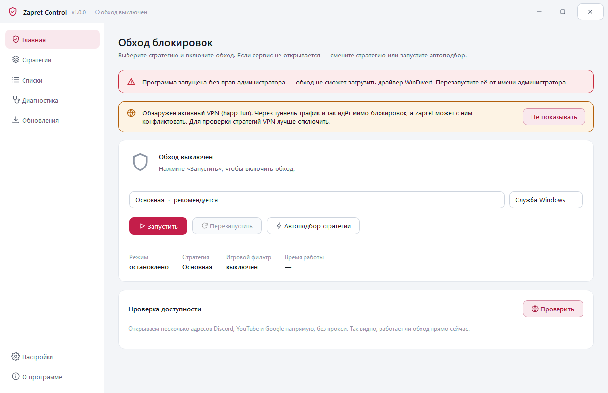
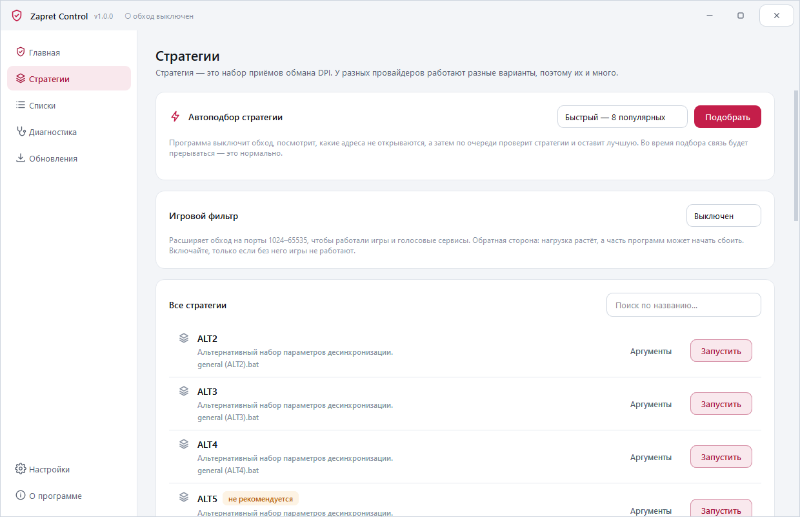
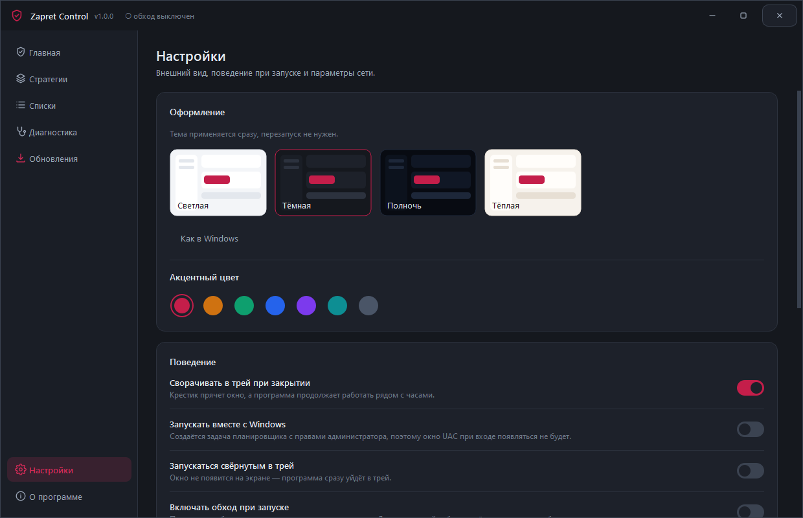
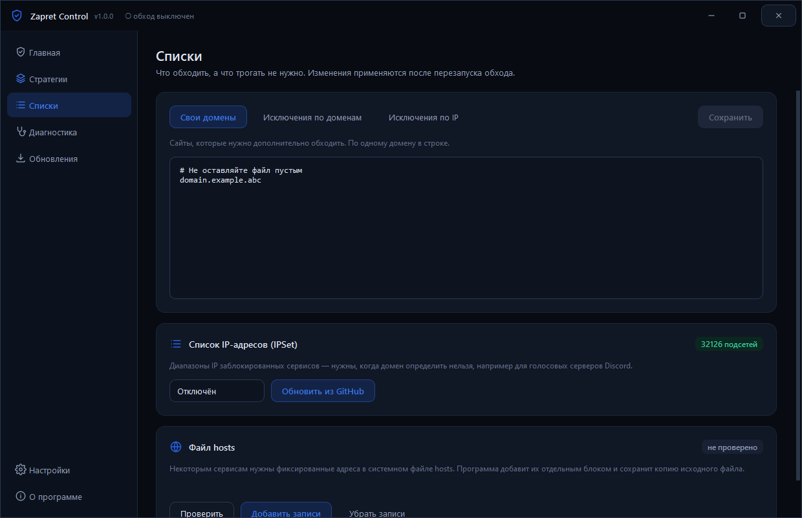
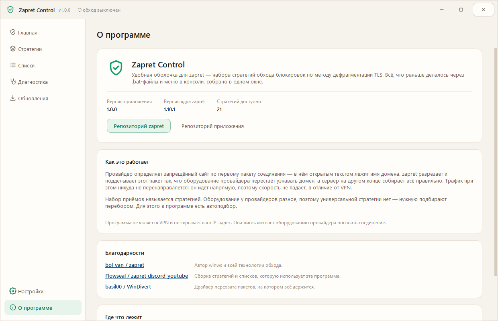

<div align="center">


[](https://github.com/77WhyNot/ZapretControl/releases/latest)
[](https://github.com/77WhyNot/ZapretControl/releases)
[](https://github.com/77WhyNot/ZapretControl/releases/latest)
[](LICENSE)

### Обход блокировок Discord и YouTube — в одном окне, без .bat и консоли

Нативное приложение для Windows поверх [zapret-discord-youtube](https://github.com/Flowseal/zapret-discord-youtube):
21 стратегия обхода, автоподбор рабочей, диагностика проблем и автообновление прямо из GitHub.

**[⬇ Скачать последнюю версию](https://github.com/77WhyNot/ZapretControl/releases/latest)**

</div>

<div align="center">

</div>

---

## Зачем это

Оригинальный zapret — набор `.bat`-файлов. Чтобы им пользоваться, нужно понимать,
чем `general (ALT4)` отличается от `general (FAKE TLS AUTO ALT2)`, вручную ставить
службу через меню в консоли, а при выходе новой версии — скачивать архив,
распаковывать и не забыть перенести свои списки.

Zapret Control убирает всё это. Программа сама читает стратегии из файлов ядра,
запускает `winws.exe` с теми же параметрами, ставит службу Windows, следит за
обновлениями и переносит настройки при обновлении.

## Что умеет

| | |
|---|---|
| **Автоподбор стратегии** | Отключает обход, смотрит, какие адреса не открываются, перебирает стратегии и оставляет ту, что реально помогла. Не нужно гадать. |
| **Два режима работы** | Служба Windows (работает всегда, в том числе после перезагрузки) или обычный процесс (живёт, пока открыта программа). |
| **Диагностика** | 16 проверок: драйвер WinDivert, служба BFE, TCP timestamps, конфликты с GoodbyeDPI, Killer, Check Point, AdGuard, SmartByte, активный VPN, шифрованный DNS, посторонние записи в hosts. У большинства проблем есть кнопка «Исправить». |
| **Автообновление** | Ядро zapret и само приложение обновляются из GitHub в один клик. Ваши списки, исключения и настройки сохраняются. |
| **Работает без GitHub** | Если GitHub заблокирован, программа сама переберёт зеркала (ghproxy, gh-proxy, ghfast, gitmirror, jsDelivr) или пойдёт через ваш прокси. |
| **Списки** | Редактор своих доменов и исключений, управление списком IP (IPSet) и безопасное редактирование `hosts` с резервной копией. |
| **Оформление** | 4 темы и 7 акцентных цветов. По умолчанию — светлая с рубиновым акцентом. |
| **Трей** | Сворачивается к часам, управляется из контекстного меню, умеет стартовать вместе с Windows без окна UAC. |

<div align="center">




</div>

## Установка

1. Скачайте `ZapretControl-Setup-x.y.z.exe` со страницы [Releases](https://github.com/77WhyNot/ZapretControl/releases/latest).
2. Запустите и нажмите «Установить».
3. Всё. Ядро zapret уже внутри установщика — ничего доскачивать не нужно.

Программа запрашивает права администратора: WinDivert загружает драйвер режима
ядра, а служба `zapret` создаётся в системе. Без этого обход не работает — так же
устроен и оригинальный zapret.

### Первый запуск

Нажмите **Запустить** на главной. Если какой-то сервис всё равно не открывается —
идите в **Стратегии → Автоподбор**. Перебор занимает пару минут, во время него
связь будет прерываться: это нормально, программа переключает стратегии.

## Антивирусы

`winws.exe` и драйвер `WinDivert64.sys` перехватывают сетевые пакеты, поэтому
антивирусы иногда реагируют на них как на угрозу. Это ложное срабатывание —
файлы взяты из официального релиза [Flowseal/zapret-discord-youtube](https://github.com/Flowseal/zapret-discord-youtube)
без изменений. Если антивирус удалил файлы, добавьте папку программы в исключения
и переустановите: вкладка «Диагностика» покажет, чего не хватает.

## Про VPN

Zapret **не является VPN**: он не шифрует трафик и не меняет ваш IP. Он ломает
распознавание домена на оборудовании провайдера, а данные идут напрямую — поэтому
скорость не падает.

Если VPN включён, обход не нужен и может конфликтовать с туннелем — программа
это заметит и предупредит. При этом обновления через VPN качаются нормально:
прямое соединение с GitHub пробуется первым.

## Как это работает

```
Zapret Control  ──читает──>  core/*.bat        (стратегии от Flowseal)
       │                          │
       │                     разбор аргументов
       │                          ↓
       ├──режим «процесс»──>  winws.exe  ──>  WinDivert (драйвер)
       └──режим «служба»───>  служба zapret ──┘
```

Программа не переписывает логику обхода: она разбирает `.bat`-файлы ядра,
подставляет пути и параметры игрового фильтра и запускает `winws.exe` с ровно
теми же аргументами, что и оригинальные скрипты. Благодаря этому новые стратегии
из обновлений подхватываются автоматически, без правок кода.

## Сборка из исходников

Нужны Windows 10/11 x64, Python 3.10+ и [Inno Setup 6](https://jrsoftware.org/isdl.php).

```bash
pip install -r requirements.txt
```

```bash
powershell -ExecutionPolicy Bypass -File build\build.ps1
```

Скрипт нарисует иконку, прогонит проверки, соберёт `dist\ZapretControl\` через
PyInstaller и упакует установщик в `dist\ZapretControl-Setup-x.y.z.exe`.

Полезные флаги: `-SkipTests` (без проверок), `-SkipInstaller` (только папка).

Запуск без сборки — `python -m app.main`. В таком режиме прав администратора
нет, поэтому обход не запустится, но интерфейс и списки работают.

### Структура

```
app/core/       ядро: разбор стратегий, запуск winws, служба, обновления, диагностика
app/ui/         интерфейс: темы, виджеты, страницы
payload/zapret/ ядро zapret, которое попадает в установщик
build/          сборка: spec, .iss, генераторы картинок, проверки
```

## Автор

**ketamine** (Ivan Milyaev) — [github.com/77WhyNot](https://github.com/77WhyNot)

Нашли ошибку или есть идея? Заводите [issue](https://github.com/77WhyNot/ZapretControl/issues).

## Благодарности

- [bol-van/zapret](https://github.com/bol-van/zapret) — сама технология обхода и `winws`.
- [Flowseal/zapret-discord-youtube](https://github.com/Flowseal/zapret-discord-youtube) — стратегии и списки, которые использует эта программа.
- [basil00/Divert](https://github.com/basil00/Divert) — драйвер WinDivert.

## Лицензия

Программа распространяется по [собственной лицензии](LICENSE): пользоваться и
делиться с друзьями можно свободно, а публиковать форки, изменённые версии и
использовать код в своих проектах — **только с письменного разрешения автора**.

Сторонние компоненты внутри программы остаются под своими лицензиями — они
перечислены в [THIRD-PARTY-NOTICES.md](THIRD-PARTY-NOTICES.md).
