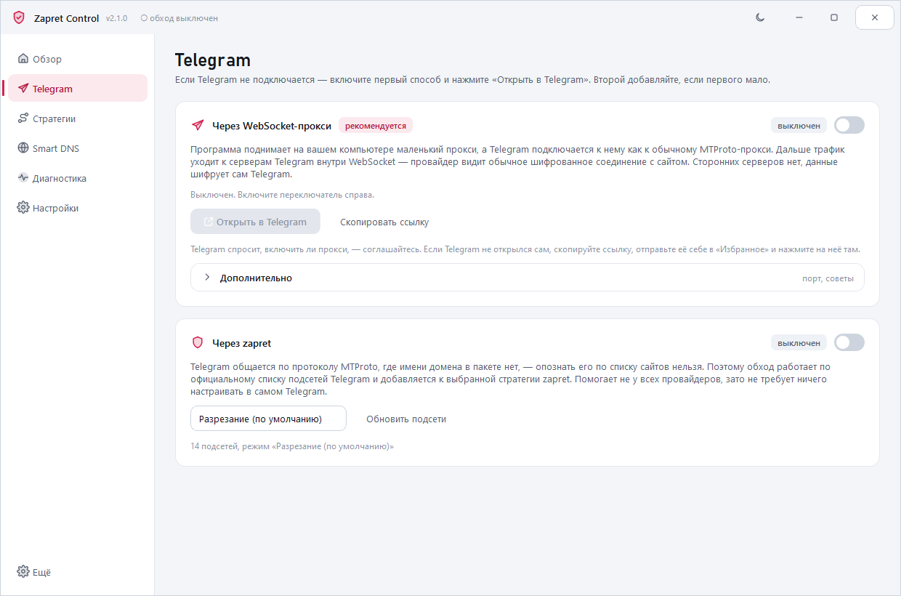
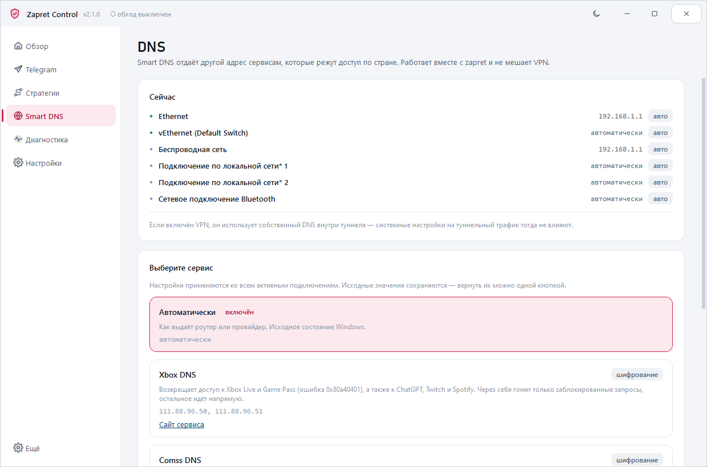
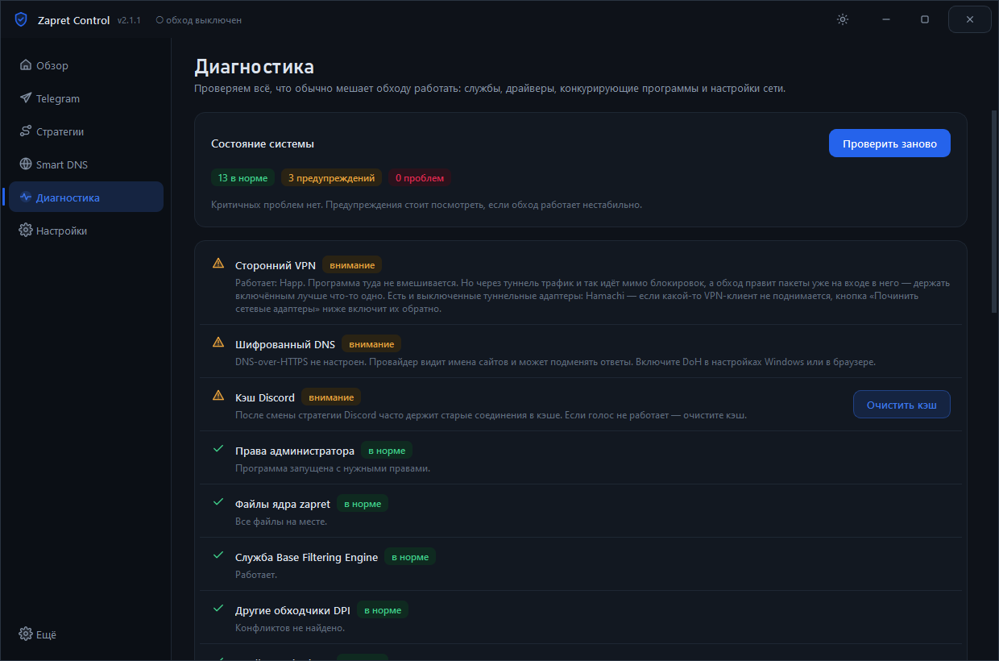
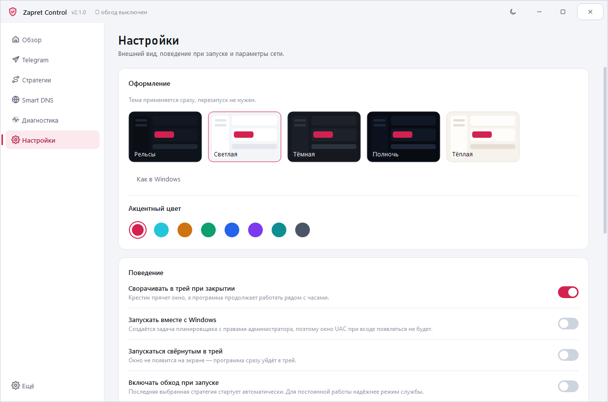

<div align="center">


[](https://github.com/77WhyNot/ZapretControl/releases/latest)
[](https://github.com/77WhyNot/ZapretControl/releases)
[](https://github.com/77WhyNot/ZapretControl/releases/latest)
[](LICENSE)

### Обход блокировок Discord, YouTube и Telegram плюс Smart DNS для Xbox — в одном окне, без .bat и консоли

Нативное приложение для Windows поверх [zapret-discord-youtube](https://github.com/Flowseal/zapret-discord-youtube):
три переключателя на главном экране — обход DPI, прокси Telegram через WebSocket и
Smart DNS для гео-ограничений. Автоподбор стратегии, диагностика и обновления,
которые ставятся сами.

**[⬇ Скачать последнюю версию](https://github.com/77WhyNot/ZapretControl/releases/latest)**

</div>

<div align="center">

</div>

---

## Зачем это

Оригинальный zapret — набор `.bat`-файлов. Чтобы им пользоваться, нужно понимать,
чем `general (ALT4)` отличается от `general (FAKE TLS AUTO ALT2)`, вручную ставить
службу через меню в консоли, а при выходе новой версии — скачивать архив,
распаковывать и не забыть перенести свои списки.

Zapret Control убирает всё это. На главном экране три переключателя: обход для
сайтов и Discord, прокси для Telegram и Smart DNS для Xbox. Всё редкое — фильтры,
списки, перезапуск — спрятано в раздел «Дополнительно», но остаётся в одном клике.
Программа сама читает стратегии из файлов ядра, ставит службу Windows, следит за
обновлениями и ставит их без вашего участия.

## Что умеет

| | |
|---|---|
| **Обход в один клик** | Переключатель на главном экране. Внизу схема: что идёт напрямую, что через zapret, что через Smart DNS, а что — через ваш VPN. |
| **21 стратегия и автоподбор** | Стратегии читаются прямо из файлов ядра. Автоподбор отключает обход, смотрит, что не открывается, перебирает варианты и оставляет тот, что реально помог. |
| **Telegram через WebSocket** | Внутри программы работает ядро [tg-ws-proxy](https://github.com/Flowseal/tg-ws-proxy): локальный MTProto-прокси, который уводит трафик Telegram в WebSocket до серверов Telegram. Провайдер видит обычное шифрованное соединение с сайтом. Включили, нажали «Открыть в Telegram» — готово. Сторонних серверов нет. |
| **Telegram через zapret** | Второй способ: MTProto не содержит имени домена, поэтому обычные стратегии его не видят. Программа добавляет секции по официальному списку подсетей Telegram — три режима на выбор. |
| **Smart DNS для Xbox** | Xbox Live, Game Pass, ошибка 0x80a40401, ChatGPT, Twitch — сервисы, которые режут по стране. Адреса [xbox-dns.ru](https://xbox-dns.ru/), а также Comss, Cloudflare, AdGuard и Google. Исходные настройки сохраняются и возвращаются одной кнопкой. |
| **Игровой фильтр и IPSet** | Те же два пункта, что в консольном меню zapret, — в разделе «Дополнительно» на главном экране, с объяснением, что они делают. |
| **Обновления сами** | Новая версия ядра zapret скачивается и ставится автоматически, обход на пару секунд перезапускается. Ваши списки и настройки сохраняются. Новая версия программы показывается плашкой на главном экране: одна кнопка, и установщик всё сделает сам. |
| **Дружит с VPN** | Если поднят Happ, Hiddify, WireGuard или другой клиент, программа это видит, показывает на схеме и не трогает ни его адаптер, ни процесс. По желанию — уступает ему дорогу: снимает обход, пока работает туннель, и возвращает после. |
| **Диагностика** | 16 проверок: драйвер WinDivert, служба BFE, TCP timestamps, конфликты с GoodbyeDPI, Killer, Check Point, AdGuard, SmartByte, чужие туннели, шифрованный DNS, hosts. У большинства проблем есть кнопка «Исправить». Плюс перезапуск Discord с очисткой кэша. |
| **Проверка доступности** | Discord, YouTube, Google, ChatGPT, Claude, Gemini — за один клик видно, что открывается, а что нет. |
| **Работает без GitHub** | Если GitHub заблокирован, программа сама переберёт зеркала (ghproxy, gh-proxy, ghfast, gitmirror, jsDelivr) или пойдёт через ваш прокси. |
| **Оформление** | 5 тем и 8 акцентных цветов, двухтоновые иконки, плавные переходы страниц и раскрывающихся разделов. Светлая ↔ тёмная — кнопкой прямо в заголовке окна. По умолчанию светлая с рубиновым акцентом. |
| **Трей** | Сворачивается к часам, включается и выключается из контекстного меню, умеет стартовать вместе с Windows без окна UAC. |

<div align="center">




</div>

<div align="center">

</div>

## Установка

1. Скачайте `ZapretControl-Setup-x.y.z.exe` со страницы [Releases](https://github.com/77WhyNot/ZapretControl/releases/latest).
2. Запустите и нажмите «Установить».
3. Всё. Ядро zapret уже внутри установщика — ничего доскачивать не нужно.

Если программа уже стояла, установщик это заметит и предложит выбор: обновить,
переустановить начисто или удалить. Списки и настройки при обновлении остаются.

Программа просит права администратора: WinDivert грузит драйвер режима ядра,
а служба zapret создаётся в системе. Иначе никак.

## Первый запуск

Включите переключатель **Обход DPI** на главном экране. Стратегия «Основная»
подходит большинству. Если Discord или YouTube всё равно не открывается —
**Стратегии → Автоподбор**. Перебор занимает пару минут, связь в это время
будет прерываться: программа переключает стратегии.

Не подключается Telegram? Включите переключатель **Telegram** и нажмите
**«Открыть в Telegram»** — мессенджер спросит, включить ли прокси. Если Telegram
не открылся сам, скопируйте ссылку на вкладке «Telegram» и отправьте себе в
«Избранное».

Для Xbox и сервисов с гео-ограничениями включите **Smart DNS** — по умолчанию это
Xbox DNS, другие сервисы на вкладке «Smart DNS». Работает вместе с обходом.

## Про VPN

Zapret **не является VPN**: он не шифрует трафик и не меняет ваш IP. Он ломает
распознавание домена на оборудовании провайдера, а данные идут напрямую, поэтому
скорость не падает.

Если у вас включён Happ, Hiddify, WireGuard или другой клиент — через туннель
трафик и так идёт мимо блокировок, а обход правит пакеты уже на входе в него, и
VPN может из-за этого рваться. Программа замечает живой туннель, показывает его
на схеме и по умолчанию **уступает ему дорогу**: снимает обход, пока работает
VPN, и возвращает, когда вы его выключите. Чужой адаптер и процесс она не трогает
никогда. Отключить это можно в настройках.

## Антивирусы

`winws.exe` и драйвер `WinDivert64.sys` перехватывают сетевые пакеты, поэтому
антивирусы иногда реагируют на них как на угрозу. Это ложное срабатывание —
файлы взяты из официального релиза [Flowseal/zapret-discord-youtube](https://github.com/Flowseal/zapret-discord-youtube)
без изменений. Если антивирус удалил файлы, добавьте папку программы в исключения
и переустановите: вкладка «Диагностика» покажет, чего не хватает.

## Как это работает

```
Zapret Control  ──читает──>  core/*.bat        (стратегии от Flowseal)
       │                          │
       │                     разбор аргументов
       │                          ↓
       ├──режим «процесс»──>  winws.exe  ──>  WinDivert (драйвер)
       └──режим «служба»───>  служба zapret ──┘

Smart DNS  ──netsh──>  DNS активных адаптеров  (туннели VPN не трогаются)

Telegram Desktop ──> 127.0.0.1:1443 (MTProto-прокси внутри программы)
                         └──WebSocket/TLS──> серверы Telegram
```

Программа не переписывает логику обхода: она разбирает `.bat`-файлы ядра,
подставляет пути, игровой фильтр и секции Telegram и запускает `winws.exe` с ровно
теми же аргументами, что и оригинальные скрипты. Благодаря этому новые стратегии
из обновлений подхватываются автоматически, без правок кода.

## Сборка из исходников

Нужны Windows 10/11 x64, Python 3.10+ и [Inno Setup 6](https://jrsoftware.org/isdl.php).

```bash
pip install -r requirements.txt
```

```bash
powershell -ExecutionPolicy Bypass -File build\build.ps1
```

Скрипт нарисует иконку, прогонит проверки, соберёт `dist\ZapretControl\` через
PyInstaller и упакует установщик в `dist\ZapretControl-Setup-x.y.z.exe`.

Полезные флаги: `-SkipTests` (без проверок), `-SkipInstaller` (только папка).

Запуск без сборки — `python -m app.main`. В таком режиме прав администратора
нет, поэтому обход не запустится, но интерфейс и списки работают.

### Структура

```
app/core/       ядро: разбор стратегий, запуск winws, служба, Smart DNS, Telegram, обновления, диагностика
app/vendor/     tg-ws-proxy — ядро прокси Telegram (MIT, без изменений)
app/ui/         интерфейс: темы, схема маршрутов, виджеты, страницы
payload/zapret/ ядро zapret, которое попадает в установщик
build/          сборка: spec, .iss, генераторы картинок, проверки
```

## Автор

**ketamine** (Ivan Milyaev) — [github.com/77WhyNot](https://github.com/77WhyNot)

Нашли ошибку или есть идея? Заводите [issue](https://github.com/77WhyNot/ZapretControl/issues).

## Благодарности

- [bol-van/zapret](https://github.com/bol-van/zapret) — сама технология обхода и `winws`.
- [Flowseal/zapret-discord-youtube](https://github.com/Flowseal/zapret-discord-youtube) — стратегии и списки, которые использует эта программа.
- [basil00/Divert](https://github.com/basil00/Divert) — драйвер WinDivert.
- [Flowseal/tg-ws-proxy](https://github.com/Flowseal/tg-ws-proxy) — прокси Telegram через WebSocket, его ядро работает внутри программы.
- [xbox-dns.ru](https://xbox-dns.ru/) — Smart DNS для гео-ограничений.

## Лицензия

Программа распространяется по [собственной лицензии](LICENSE): пользоваться и
делиться с друзьями можно свободно, а публиковать форки, изменённые версии и
использовать код в своих проектах — **только с письменного разрешения автора**.

Сторонние компоненты внутри программы остаются под своими лицензиями — они
перечислены в [THIRD-PARTY-NOTICES.md](THIRD-PARTY-NOTICES.md).
